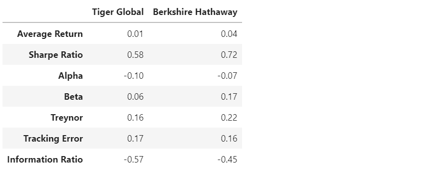

# Analyzing the Risk/Return of 4 Funds.

Analyze the risk/return of 4 funds and recommend a fund based on Sharpe ratio, Beta, Treynor measure and Information ratio. 

Based on the Sharpe Ratios, we can pick two funds Tiger and Berkshire for further analysis


For the same amount of risk, Berkshire provides the best risk-return with an annualized sharpe ratio of 0.72. It is even better than S&P 500 (annualized sharpe ratio of 0.59). Paulson offers the worst risk return providing a negative return for the same risk with an annualized sharpe ratio of -0.19. Sharpe ratio indicated excess return adjusted for risk. Higher the sharpe ratio, higher the return adjusted for the same amount of risk. Tiger comes a close second in terms of Sharpe Ratios.

The statistics for the final two funds are



Past performance is not indicative of future performance. But if we need to pick a portfolio based on past performance, we need to see if the portfolio we are going to pick is going to be the entire investment fund or part of an existing portfolio. 

If the portfolio we pick is going to be the entire investment fund, Berkshire would be preferable because of a higher sharpe ratio which measures the excesss return (reward) to total risk (systematic and nonsystematic). So, essentially if past performance indicates future performance, Berkshire has a better potential for producing excess return for same total risk/volatility than Tiger. 

If the portfolio we pick is going to be a subportfolio of our investment fund, which includes other non-S&P 500 portfolios, we need to look at the Treynor Measure which measures the execess return per systematic risk (since the non systematic risk would be diversified away in the presence of other portfolios). The Treynor measure of Berkshire is higher than Tiger. So, Berkshire will produce more return per unit of systematic risk and will contribute more to the overall portfolio.   

If the active portfolio we pick is going to be mixed with S&P 500 index portfolio, we need to look at the information ratio which measures abnormal return or alpha (in reference to the benchmark S&P 500 index) per unit of non systematic risk. It is negative for both because they both underperform the market or the S&P 500. But the information ratio for Berkshire is greater than Tiger's. So, Berkshire will contribute more to this portfolio with its nonsystematic risk getting diversified by holding the S&P 500 index.

So overall, Berkshire will be a better bet when chosing a portfolio in most of the scenarios. 

If the user is not concerned about return and mostly concerned about reducing risk, they could opt for the Tiger portfolio. Based on Beta only, Tiger has a much lower average Beta and much lower rolling Beta than Berkshire. Lower Beta indicates lower volatility vis a vis the S&P 500 as compared to Berkshire and less sensitivity to S&P500. So, Tiger is adding lower risk as compared to Berkshire and still has a comparable sharpe ratio as Berkshire. Therefore Tiger could be included in the portfolio to get equivalent returns for a much lower risk. Please bear in mind that both Beta and sharpe ratio are not forward looking measures. They account for the historical/past performance and historic perfomance may not necessarily reflect the future performance. Kendall correlation (Since Pearson or default correlation relies on normality, it is preferable to use kendal correlation which is more robust) indicates that Berkshire daily returns are more correlated with the market as compared to the Tiger daily returns which is what the Beta also indicates. So, Tiger could add diversification value to the portfolio in the form of reducing risk.s

---

## Technologies

This project uses python 3.7 along with the following packages:

* [JupyterLab](https://jupyterlab.readthedocs.io/en/stable/) - Web based user interface for data analysis.

* [pandas](https://github.com/pandas-dev/pandas) - Data analysis and manipulation library.

* [numpy](https://github.com/numpy/numpy) - NumPy is the fundamental package needed for scientific computing with Python.

* [pathlib](https://docs.python.org/3/library/pathlib.html) - This module offers classes representing filesystem paths with semantics appropriate for different operating systems.

* [matplotlib](https://github.com/matplotlib/matplotlib) - Library for creating visualization in Python.

---

## Installation Guide

Please install the following before starting the application

```python
  pip install jupyterlab
  pip install pandas
  pip install numpy
  pip install pathlib
  pip install matplotlib
```
In case of issues, please see the requirements.txt for a complete list of packages with versions needed to run this application

---

## Usage

To use the return risk analysis, please download and open the **risk_return_analysis.ipynb** in jupyter lab after executing
the following on the command line:

```python
jupyter lab
```
Jupytper Lab should open automatically in a browser. 
If it does not, please follow the instructions on the command line.

---

## Contributors

Sangram Singh (sangramsinghg@yahoo.com)

---

## License

MIT

